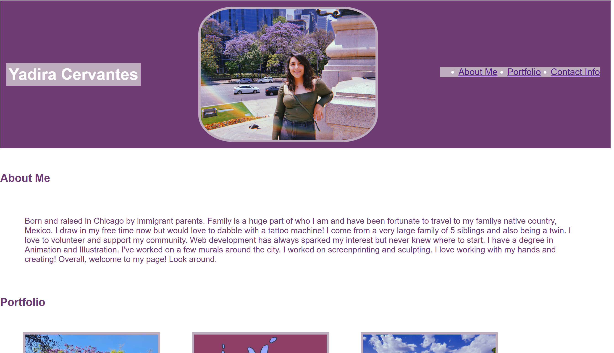
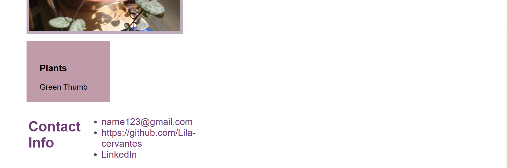

# YC-Portfolio

## Description

My motivation for this assignment was to create a page that I can go back to in the future. Being an artist and eventually a coder, I would love to be able to demonstrate my coding skills and art work all on one page.

I learned that organization is key and to ask many questions. At first my tags were not lining up and I had to start over a few times. I've had TA's and tutors help me with anything I was confused on. This was, in my case, a tough one to get down but I'm glad it placed me in right direction of what this course can help me achieve.

## Screen Shots

## Features

If you move your cursor to the navigation bar it will take you to each section of the page. Such as, clicking on "About-Me", it will take you to that section on the page.